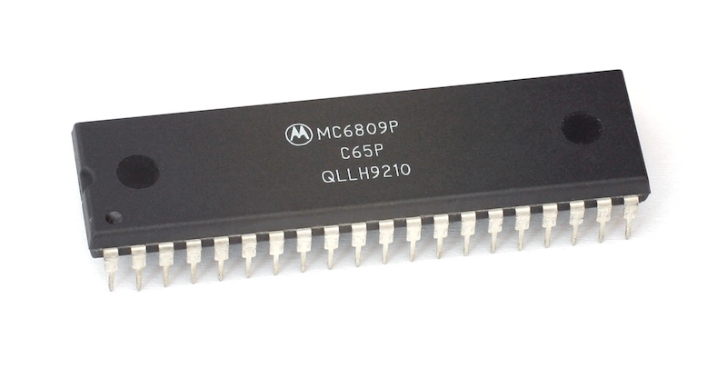

# MC6809



## Introduction

An emulation library for the MC6809 cpu written in C++. This software forms the core of [E64](https://github.com/elmerucr/E64), a virtual computer system. To use this library, copy the five source files in ```./src/``` to your project. This source with some test programs can also be built directly using a standard cmake procedure.

## API

### Constructor

```cpp
mc6809::mc6809(bus_read r, bus_write w)
```

The constructor takes two function pointers that respectively read and write one byte to memory. The prototypes are as follows:

```cpp
uint8_t read(uint16_t address);

void write(uint16_t address, uint8_t byte);
```

Make sure the connected memory has a functioning ROM and vector table from $fff0 to $ffff. Please note that an extra vector at $fff0 (originally reserved by Motorola) has been added that enables handling of illegal opcodes (a feature from the Hitachi 6309).

### NMI / FIRQ / IRQ

When not assigned by the hosting software, the pin states will default to high (1) internally, effectively meaning no exceptions of the above three types will happen. It is up to the programmer to supply a connection:

```cpp
void mc6809::assign_nmi_line(bool *line);

void mc6809::assign_firq_line(bool *line);

void mc6809::assign_irq_line(bool *line);
```

These functions take a pointer to a boolean value (the line/value that represent interrupt states from the connected devices). If more devices are to be connected to one line, this must be separately programmed (see [E64](https://github.com/elmerucr/E64) source code for examples).

### Reset

```cpp
void mc6809::reset();
```

## Links

* [E64](https://github.com/elmerucr/E64) - A virtual computer system inspired by the Commodore 64 using an MC6809 cpu and implementing some Amiga 500 and Atari ST technology.
* [lib65ce02](https://github.com/elmerucr/lib65ce02) - CSG65CE02 emulator written in C.
* [Moira](https://github.com/dirkwhoffmann/Moira) - Motorola 68000 cpu emulator written in C++ by Dirk W. Hoffmann.
* [vAmiga](https://dirkwhoffmann.github.io/vAmiga/) - An Amiga 500, 1000, or 2000 on your Apple Macintosh by Dirk W. Hoffmann.
* [vasm](http://sun.hasenbraten.de/vasm/) - A portable and retargetable assembler.
* [VICE](http://vice-emu.sourceforge.net) - The Versatile Commodore Emulator.
* [VirtualC64](https://dirkwhoffmann.github.io/virtualc64/) - A Commodore 64 on your Apple Macintosh by Dirk W. Hoffmann.
* [vlink](http://sun.hasenbraten.de/vlink/) - A portable linker for multiple file formats.

## References

Leventhal, Lance A. 1981. 6809 ASSEMBLY LANGUAGE PROGRAMMING. OSBORNE/McGraw-Hill.

Motorola. 1981. MC6809-MC6809E 8-BIT Microprocessor Programming Manual. Motorola Inc.

Motorola Semiconductors. 1983. MC6809 Datasheet.

Osborne, Adam. 1976. An introduction to microcomputers - Volume I Basic Concepts. SYBEX.

Zaks, Rodnay and William Labiak. 1982. Programming the 6809. SYBEX.
